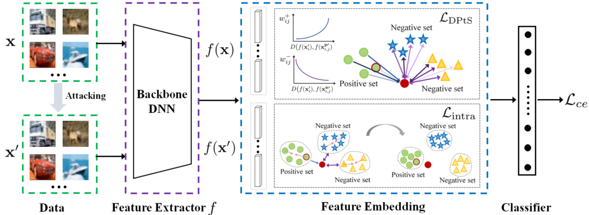

# DPtSTrip: Adversarially Robust Learning with Distance-Aware Point-to-Set Triplet Loss (Submitted to Pattern Recognition 2025)


This repository is a PyTorch implementation of the DPtSTrip. The paper has been submitted to Pattern Recognition Journal.

## reqarements
- Ubuntu 16.04.7
- pytorch 1.8.1
- advertorch 0.2.3
- torchattacks 3.4.0
- numpy 1.23.5

## Framework
The framework of DPtSTrip.




## train DPtSTrip and DPtSTrip-Fit
 
``main/DPtSTrip_cifar10_Euclidean_train.py`` -- ( for cifar10).

``main/DPtSTrip-Fit_cifar10_Euclidean_train.py`` -- ( for cifar10).

DPtSTrip and DPtSTrip-Fit can be trained on other datasets in the same way as cifiar10

## Citation
```
@article{Wang2024Adversarially,
  author = "Ran, Wang and Meng, Hu and Xinlei, Zhou and Yuheng, Jia",
  title = " DPtSTrip: Adversarially Robust Learning with Distance-Aware Point-to-Set Triplet Loss",
  journal = "Submitted to Pattern Recognition ",
  year = "2025"
}
```


