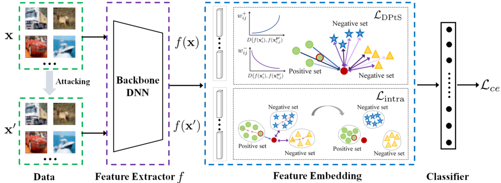

# README.md

# DPtSTrip: Adversarially Robust Learning with Distance-Aware Point-to-Set Triplet Loss

<div align="center">


</div>


## 📖 Overview

This repository provides the official PyTorch implementation of **DPtSTrip** and **DPtSTrip-Fit**, proposed in:

> **Ran Wang**, **Meng Hu**, **Xinlei Zhou**, **Yuheng Jia**，DPtSTrip: Adversarially robust learning with distance-aware point-to-set triplet loss，Pattern Recognition*, Volume **173**, Article **112840**, 2026.

DPtSTrip introduces a novel **Distance-Aware Point-to-Set Triplet Loss** framework for adversarially robust learning. By replacing conventional point-to-point metric constraints with point-to-set optimization, DPtSTrip significantly improves:

- Robust feature representation under adversarial perturbations
- Intra-class compactness
- Inter-class separability
- Generalization across diverse adversarial attacks

This framework is particularly suitable for robust classification tasks where both clean accuracy and adversarial robustness are essential.

---

## ✨ Key Features

- 🔒 **Distance-Aware Point-to-Set Triplet Loss**
- 🛡️ Strong adversarial robustness against:
  - FGSM
  - PGD
  - CW
  - AutoAttack
- 📏 Improved feature manifold structuring
- 🚀 Supports both DPtSTrip and DPtSTrip-Fit variants
- 🌍 Easily extendable to CIFAR-10, CIFAR-100, SVHN, Tiny-ImageNet, and custom datasets
- 🧠 PyTorch-based modular implementation for research and development

---

## 🧠 Framework

The overall framework of DPtSTrip:

<p align="center">
  
</p>

### Core Insight

Traditional triplet learning focuses on point-to-point relationships. DPtSTrip instead formulates robust representation learning through **distance-aware point-to-set constraints**, enabling stronger semantic consistency and adversarial resilience.

---

## 🛠️ Requirements

### System Environment

- Ubuntu 16.04.7 / Ubuntu 20.04+
- Python >= 3.9
- PyTorch 1.8.1
- advertorch 0.2.3
- torchattacks 3.4.0
- numpy 1.23.5

### Installation

```bash
conda create -n dptstrip python=3.9
conda activate dptstrip

pip install torch==1.8.1 torchvision
pip install advertorch==0.2.3
pip install torchattacks==3.4.0
pip install numpy==1.23.5
````

---

## 📂 Repository Structure

```bash
DPtSTrip/
│
├── main/
│   ├── DPtSTrip_cifar10_Euclidean_train.py
│   ├── DPtSTrip-Fit_cifar10_Euclidean_train.py
│   ├── DPtSTrip_cifar100_Euclidean_train.py
│   └── DPtSTrip_svhn_Euclidean_train.py
│
├── images/
│   └── framework.png
│
├── models/
│   ├── backbone/
│   └── loss/
│
├── utils/
│   ├── attacks/
│   ├── datasets/
│   └── evaluation/
│
├── LICENSE
└── README.md
```

---

## 🚀 Training

### Train DPtSTrip on CIFAR-10

```bash
python main/DPtSTrip_cifar10_Euclidean_train.py
```

### Train DPtSTrip-Fit on CIFAR-10

```bash
python main/DPtSTrip-Fit_cifar10_Euclidean_train.py
```


## 🌍 Dataset Extension

DPtSTrip can be adapted to:

* CIFAR-10
* CIFAR-100
* SVHN
* Tiny-ImageNet
* Custom datasets


## 📈 Evaluation

Recommended evaluation metrics:

* Natural Accuracy
* FGSM Robust Accuracy
* PGD-20 / PGD-100
* CW Attack Robustness
* AutoAttack Robustness


---

## 📝 Citation

If you find this work useful, please cite:

```bibtex
@article{Wang2026DPtSTrip,
  author  = {Ran Wang and Meng Hu and Xinlei Zhou and Yuheng Jia},
  title   = {DPtSTrip: Adversarially robust learning with distance-aware point-to-set triplet loss},
  journal = {Pattern Recognition},
  volume  = {173},
  pages   = {112840},
  year    = {2026}
}
```


## 🤝 Acknowledgements

We sincerely thank:

* PyTorch
* Advertorch
* Torchattacks
* Pattern Recognition Community
* Adversarial Machine Learning Researchers

